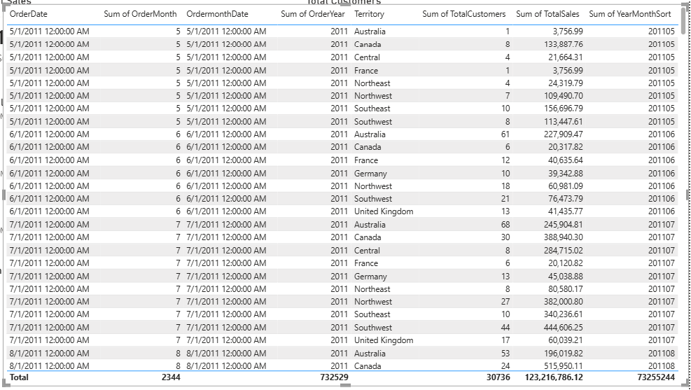
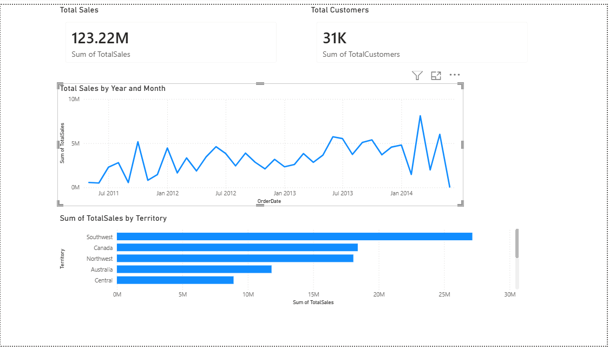

# 📊 Executive Sales Performance Dashboard (Power BI)
### Overview
This repository contains a Power BI walkthrough created to demonstrate my practical knowledge of the Power BI platform.

The project showcases a range of Power BI skills I have developed through continuous learning and hands-on practice. Each section focuses on a specific capability, illustrating how Power BI can be used to transform raw data into clear, actionable insights.

The goal of this repository is not just to display visuals, but to show how data is modeled, calculated, and presented in a way that supports business decision-making.

## Key Skills Demonstrated
- Data cleaning and preparation
- Data modeling and relationships
- DAX fundamentals (measures, calculated columns)
- Aggregations and business logic
- Interactive report design and visuals
- Filtering, slicers, and user-driven exploration

## Project Structure

The repository is organized to reflect a typical Power BI workflow:

- Data
    Source data used in the reports (or description of the data source if not included)

- Reports
    Power BI (.pbix) files demonstrating different features and use cases

- Documentation
    Notes and explanations describing modeling choices, calculations, and design decisions

Each report focuses on a specific concept or skill rather than trying to do everything at once.

## Tools & Technologies
- Power BI Desktop
- DAX
- Power Query
- (Optional: SQL / Excel if applicable)

# 📊 Sales Performance Dashboard (Power BI)

## 📌 Project Overview

This project was created to demonstrate my ability to design and build an executive-level dashboard in Power BI for potential recruiters and hiring managers.

Using the AdventureWorks dataset, I developed a structured dashboard that highlights total sales performance, customer volume, and geographic revenue distribution. The focus of this project was not only on data visualization, but also on creating a clean, well-aligned layout that reflects professional reporting standards.

---

## 📂 Dataset

- **Source:** AdventureWorks (SQL Server sample database)
- **Data Model:** DirectQuery
- **Key Fields Used:**
  - OrderDate
  - Total Sales
  - Total Customers
  - Territory

---

## 📈 Dashboard Overview

This dashboard allows users to quickly understand:

- Total sales performance
- Total number of customers
- Sales trends over time
- Revenue distribution by territory

The layout follows a clear hierarchy:
- KPI summary at the top
- Time-series trend in the middle
- Geographic breakdown at the bottom

---

## 🛠 Skills Demonstrated

- Designed and structured an executive-style dashboard layout  
- Adjusted visual size, alignment, and positioning for clean hierarchy and readability  
- Configured continuous date axis for time-series analysis  
- Built KPI cards for high-level performance tracking  
- Applied spacing and alignment principles for professional presentation  
- Worked within DirectQuery model constraints  

---

## 📷 Dashboard Preview

---

## 🚀 Tools Used

- Power BI Desktop
- SQL Server (AdventureWorks Database)
- GitHub
- VS Code

---

